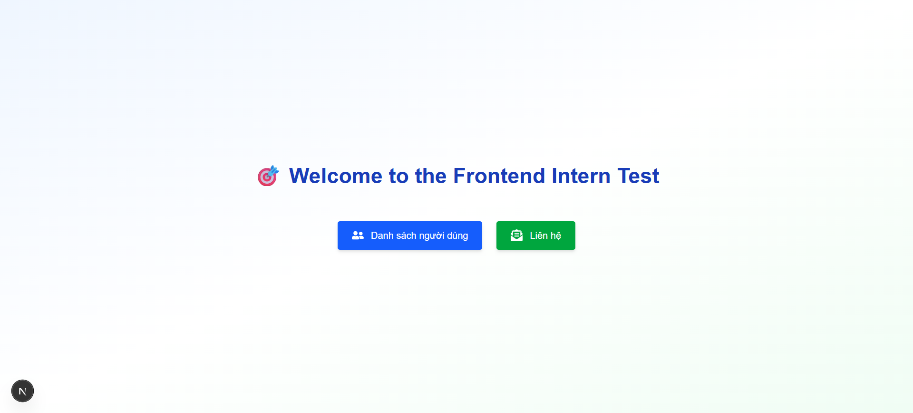
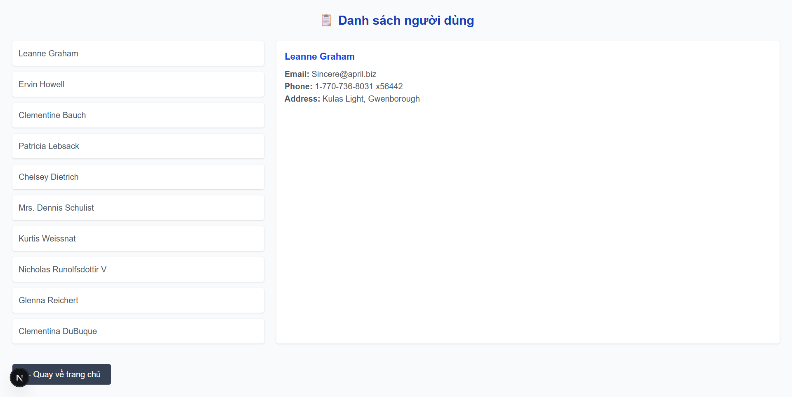
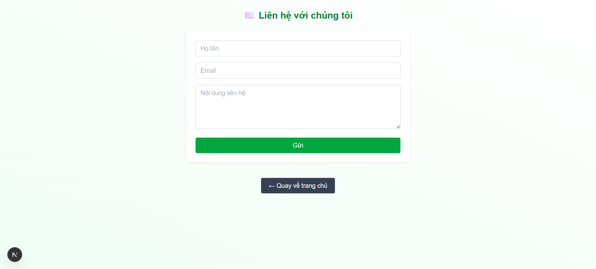

# 🌐 Frontend Intern Test – Next.js + TailwindCSS

Bài test gồm 3 trang được xây dựng bằng Next.js (App Router) & TailwindCSS, bao gồm:

- ✅ Trang chủ (`/`): giao diện chọn chức năng
- ✅ Trang danh sách người dùng (`/users`)
- ✅ Trang form liên hệ (`/contact`)

---

## 🚀 Cách chạy dự án

### ⚙️ Yêu cầu:

- Node.js >= 18.x
- npm hoặc yarn

### 📦 Cài đặt thư viện:

```bash
npm install
```
### ▶️ Chạy server:
```bash
npm run dev
```
### 🌐 Mở trình duyệt và truy cập:
```bash
http://localhost:3000
```

## ✅ Tính năng

- Giao diện responsive (Tailwind)

- Fetch API người dùng từ JSONPlaceholder

- Form liên hệ có validate và gửi dữ liệu bằng POST

- Navigation giữa các trang (Next.js App Router)

### 🏠 Giao diện trang chủ


### 👥 Giao diện danh sách người dùng


### ✉️ Giao diện form liên hệ


## 🌐 Link figma:
```bash
https://www.figma.com/proto/thRJ1NUcZHgZKhIFDEXP29/Intern-test?node-id=0-1&t=ALNqZIeu1BYXduzQ-1
```